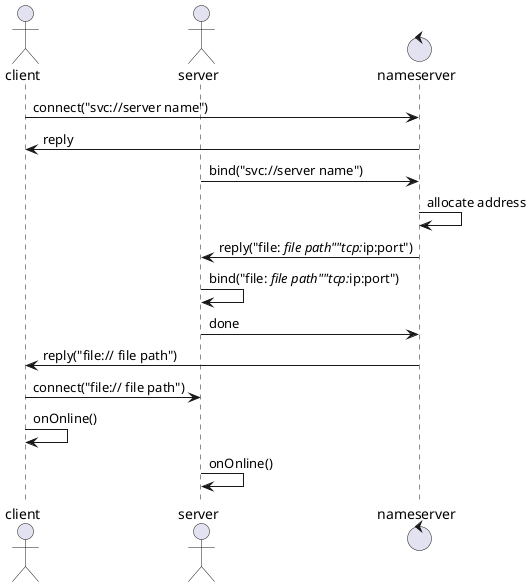

[toc]

### about
QNX 8.0
FDBus v5.4.0

### compile
> source /[your sdp path]/qnxsdp-env.sh
> sh build.sh

### sequence diagram

```plantuml
@startuml
actor client
actor server
control nameserver

client -> nameserver : connect("svc://server name")
nameserver -> client : reply

server -> nameserver : bind("svc://server name")
nameserver -> nameserver : allocate address
nameserver -> server : reply("file:// file path""tcp://ip:port") 
server -> server : bind("file:// file path""tcp://ip:port")
server -> nameserver : done
nameserver -> client : reply("file:// file path")
client -> server : connect("file:// file path")
client -> client : onOnline()
server -> server : onOnline()

@enduml
```