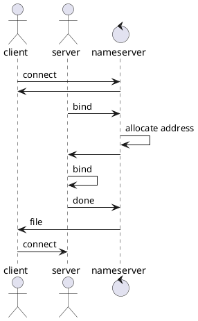

[toc]
### 
QNX 8.0
FDBus v5.4.0

### compile
> mkdir build
> cd build
> cmake ../
> make

### sequence diagram

```plantuml
@startuml
actor client
actor server
control nameserver

client -> nameserver: connect
nameserver -> client:

server -> nameserver:bind
nameserver -> nameserver: allocate address
nameserver -> server: 
server -> server: bind
server -> nameserver: done
nameserver -> client: file
client -> server: connect

@enduml
```